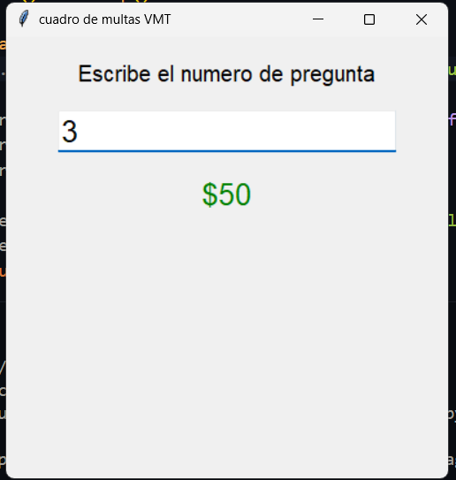

# bitacora para el cuadro de multas del VMT

tiene las preguntas y respuestas de las las preguntas.

- mejoras

usando la libreria de interfaces graficas de python (tkinter).
se mejoro la estetica y la manipulacion del programa.

